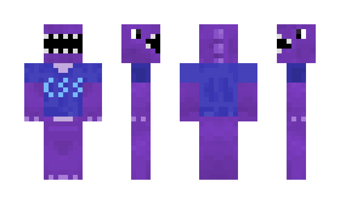

#  [Computer Science Society - Brand Guidelines](https://github.com/CSSUoB/resources)

This document is intended to serve as a guide to the use of the CSS logos.

## Colours

### CSS Logo

|                    | Name       | Hex Code   | Red | Green | Blue | Logo and Website                                     | Publicity     | Discord          |
|--------------------|------------|------------|-----|-------|------|------------------------------------------------------|---------------|------------------|
|![][col-dark-blue]  | Dark Blue  | `#2f3c63;` | 47  | 60    | 99   | Logo Background                                      |               |                  |
|![][col-orange]     | Orange     | `#ff9c00;` | 255 | 156   | 0    | Logo Syntax Highlighting  (Identifier)           | 5th Highlight | Pronoun Roles    |
|![][col-light-blue] | Light Blue | `#58cad6;` | 88  | 202   | 214  | Logo Syntax Highlighting  (Brackets and Braces)  | 2nd Highlight | Committee Role   |     
|![][col-white]      | White      | `#ffffff;` | 255 | 255   | 255  | Logo Syntax Highlighting  (Parentheses and Plus) | Text on dark  |                  |
|![][col-green]      | Green      | `#03e421;` | 3   | 228   | 33   | Logo Syntax Highlighting  (Numbers)              | 3rd Highlight | Member Role      |
|![][col-yellow]     | Yellow     | `#fdff8a;` | 253 | 255   | 138  | Comment text when using Dark Blue Background         | 4th Highlight | Bot Roles        |

[col-dark-blue]: https://via.placeholder.com/15/2f3c63/000000?text=+
[col-orange]: https://via.placeholder.com/15/ff9c00/000000?text=+
[col-light-blue]: https://via.placeholder.com/15/58cad6/000000?text=+
[col-white]: https://via.placeholder.com/15/ffffff/000000?text=+
[col-green]: https://via.placeholder.com/15/03e421/000000?text=+
[col-yellow]: https://via.placeholder.com/15/fdff8a/000000?text=+

Other colous and styles can be used for promotional material. e.g. Canva designs. These do not necessarily need to follow the colour scheme of the logo:

### TeX Colours

|                              | Name                 | Hex Code   | Red | Green | Blue | Usage                                        |
|------------------------------|----------------------|------------|-----|-------|------|----------------------------------------------|
|![][col-purple]               | TeX / Purple         | `#9d68dc;` | 157 | 104   | 220  | 1st Highlight                                |
|![][col-tex-shadow]           | TeX Shadow           | `#793fd8;` | 121 | 63    | 216  |                                              |
|![][col-tex-highlight]        | TeX Highlight        | `#c3abdf;` | 195 | 171   | 223  |                                              |
|![][col-tex-highlight-shadow] | TeX Highlight Shadow | `#ad8adb;` | 173 | 138   | 219  |                                              |
|![][col-tex-lowlight]         | TeX Lowlight         | `#6f5193;` | 111 | 81    | 147  |                                              |
|![][col-tex-lowlight-shadow]  | TeX Lowlight Shadow  | `#463185;` | 70  | 49    | 113  |                                              |
|![][col-tex-blue]             | TeX Blue             | `#3b37b6;` | 59  | 55    | 182  |                                              |
|![][col-tex-blue-shadow]      | TeX Blue Shadow      | `#2521ad;` | 37  | 33    | 173  |                                              |
|![][col-tex-detail]           | TeX Detail           | `#77bbfe;` | 119 | 187   | 254  |                                              |
|![][col-tex-detail-shadow]    | TeX Detail Shadow    | `#4a9efe;` | 74  | 158   | 254  |                                              |
|![][col-tex-outline]          | TeX Outline          | `#35234a;` | 53  | 35    | 74   |                                              |
|![][col-tex-blue-outline]     | TeX Blue Outline     | `#1d1b57;` | 29  | 27    | 87   |                                              |

[col-purple]: https://via.placeholder.com/15/9d68dc/000000?text=+
[col-tex-shadow]: https://via.placeholder.com/15/793fd8/000000?text=+
[col-tex-highlight]: https://via.placeholder.com/15/c3abdf/000000?text=+
[col-tex-highlight-shadow]: https://via.placeholder.com/15/463185/000000?text=+
[col-tex-lowlight]: https://via.placeholder.com/15/6f5193/000000?text=+
[col-tex-lowlight-shadow]: https://via.placeholder.com/15/463185/000000?text=+
[col-tex-blue]: https://via.placeholder.com/15/3b37b6/000000?text=+
[col-tex-blue-shadow]: https://via.placeholder.com/15/2521ad/000000?text=+
[col-tex-detail]: https://via.placeholder.com/15/77bbfe/000000?text=+
[col-tex-detail-shadow]: https://via.placeholder.com/15/4a9efe/000000?text=+
[col-tex-outline]: https://via.placeholder.com/15/35234a/000000?text=+
[col-tex-blue-outline]: https://via.placeholder.com/15/1d1b57/000000?text=+

### Additional Colours

|                    | Name       | Hex Code   | Red | Green | Blue | Usage                                        |
|--------------------|------------|------------|-----|-------|------|----------------------------------------------|
|![][col-light-grey] | Light Grey | `#d9d9d9;` | 217 | 217   | 217  | Publicity: Subtling on colour                |   
|![][col-grey]       | Grey       | `#a6a6a6;` | 166 | 166   | 166  | Subtling on dark                             |
|![][col-dark-grey]  | Dark Grey  | `#595959;` | 89  | 89    | 89   | Subtling on light                            | 
|![][col-black]      | Black      | `#000000;` | 0   | 0     | 0    | Text on light                                |
|![][col-blue-grey]  | Blue-Grey  | `#3b8b94;` | 59  | 139   | 148  | Discord: Committee-Elect Role                |

[col-light-grey]: https://via.placeholder.com/15/d9d9d9/000000?text=+
[col-grey]: https://via.placeholder.com/15/a6a6a6/000000?text=+
[col-dark-grey]: https://via.placeholder.com/15/595959/000000?text=+
[col-black]: https://via.placeholder.com/15/000000/000000?text=+
[col-blue-grey]: https://via.placeholder.com/15/3b8b94/000000?text=+

## Logos

### Guild of Students and University of Birmingham Logo

Follow the advice issued by the Guild Of Students on use of the Guild and University logos. 
The advice is available through the Committee Admin page, on the Guild website.

### CSS

In all cases, the full logo should be used. The bold variant should be preferred, where possible, but is not required. They are available in this repository.

## Fonts

For the purposes of recreating the logo:

The font to be used in the logos is the bold variant of [Inconsolata](https://fonts.google.com/specimen/Inconsolata). The text should always be bold in the logo. 

Publicity graphics may also make use of [JetBrains Mono](https://fonts.google.com/specimen/JetBrains+Mono) and [Roboto](https://fonts.google.com/specimen/Roboto).

| Element | Usage             | Font                        | Size        |
|---------|-------------------|-----------------------------|-------------|
| h1      | Main Title        | JetBrains Mono Bold         | 24          | 
| h2      | Section Title     | JetBrains Mono Bold         | 18pt / 24px | 
| h3      | Subtitle / Date   | JetBrains Mono Light Italic | 16pt / 24px |
| h4      | Sub-section Title | JetBrains Mono Bold         | 14pt / 22px |
| p       | Main Body         | Roboto                      | 11pt / 16px |

## Files

The provided `svg`, `eps` and `png` files in this repository should always be used. Where possible the vector formats should be preferred to maintain quality and ensure the images are rasterised to the correct resolution.

There is no need to recreate the logo, except as a last resort.

## Stickers

Stickers are purchased on [stickermule.com](https://stickermule.com), and are Die Cut stickers. If full bleed is needed, it needs to be requested in the instructions to StickerMule to create the proof.

| Sticker Preview                   | Name           | File Name                                                                                                  | Size - w×h (mm) | Cutting    |
|-----------------------------------|----------------|------------------------------------------------------------------------------------------------------------|-----------------|------------|
| ![Mini Logo][mini-logo]           | Mini Logo      | [`stickers/mini-logo.png`][mini-logo]                                                                      | 50 x 30         | Full Bleed | 
| ![Hex][hex]                       | Hex            | [`stickers/hex.png`][hex]                                                                                  | 43 x 50         | Full Bleed |
| ![Original TeX][original-tex]     | Original TeX   | [`dinosaur/raster/tex_original.png`][original-tex] [`dinosaur/tex_original.svg`][original-tex-svg]         | 50 x 46         | Die Cut    |
| ![Christmas TeX][christmas-tex]   | Christmas TeX  | [`dinosaur/raster/tex_christmas.png`][christmas-tex] [`dinosaur/tex_christmas.svg`][christmas-tex-svg]     | 50 x 46         | Die Cut    |
| ![Ball TeX][ball-tex]             | Ball TeX       | [`dinosaur/raster/tex_ball.png`][ball-tex] [`dinosaur/tex_ball.svg`][ball-tex-svg]                         | 50 x 46         | Die Cut    |
| ![Pride TeX][pride-tex]           | Pride TeX      | [`dinosaur/raster/tex_pride.png`][pride-tex] [`dinosaur/tex_pride.svg`][pride-tex-svg]                     | 50 x 46         | Die Cut    |
| ![BBQ TeX][bbq-tex]               | BBQ TeX        | [`dinosaur/raster/tex_bbq.png`][bbq-tex] [`dinosaur/tex_bbq.svg`][bbq-tex-svg]                             | 62 x 55         | Die Cut    |
| ![Graduation TeX][graduation-tex] | Graduation TeX | [`dinosaur/raster/tex_graduation.png`][graduation-tex] [`dinosaur/tex_graduation.svg`][graduation-tex-svg] | 50 x 48         | Die Cut    |
| ![Old Joe TeX][old-joe-tex]       | Old Joe TeX    | [`dinosaur/raster/tex_old-joe.png`][old-joe-tex] [`dinosaur/tex_old-joe.svg`][old-joe-tex-svg]             | 50 x 71         | Die Cut    |
| ![Megaphone TeX][megaphone-tex]   | Megaphone TeX  | [`dinosaur/raster/tex_megaphone.png`][megaphone-tex] [`dinosaur/tex_megaphone.svg`][megaphone-tex-svg]     | 61 x 46         | Die Cut    |
| ![Halloween TeX][halloween-tex]   | Halloween TeX  | [`dinosaur/raster/tex_halloween.png`][halloween-tex] [`dinosaur/tex_halloweeen.svg`][halloween-tex-svg]    | 50 x 46         | Die Cut    |
| ![Speech TeX][speech-tex]         | Speech TeX     | [`dinosaur/raster/tex_speech.png`][speech-tex] [`dinosaur/tex_speech.svg`][speech-tex-svg]                   | 52 x 50         | Die Cut    |
| ![Ballot TeX][ballot-tex]         | Ballot TeX     | [`dinosaur/raster/tex_ballot.png`][ballot-tex] [`dinosaur/tex_ballot.svg`][ballot-tex-svg]                   | 51 x 46         | Die Cut    |

N.B.: The die-cut dimensions include the white border around the graphic. So the actual TeX image will be smaller. 

[mini-logo]: stickers/mini-logo.png
[hex]: stickers/hex.png
[original-tex]: dinosaur/raster/tex_original.png
[christmas-tex]: dinosaur/raster/tex_christmas.png
[ball-tex]: dinosaur/raster/tex_ball.png
[pride-tex]: dinosaur/raster/tex_pride.png
[bbq-tex]: dinosaur/raster/tex_bbq.png
[graduation-tex]: dinosaur/raster/tex_graduation.png
[old-joe-tex]: dinosaur/raster/tex_old-joe.png
[megaphone-tex]: dinosaur/raster/tex_megaphone.png
[halloween-tex]: dinosaur/raster/tex_halloween.png
[speech-tex]: dinosaur/raster/tex_speech.png
[ballot-tex]: dinosaur/raster/tex_ballot.png

[original-tex-svg]: dinosaur/tex_original.svg
[christmas-tex-svg]: dinosaur/tex_christmas.svg
[ball-tex-svg]: dinosaur/tex_ball.svg
[pride-tex-svg]: dinosaur/tex_pride.svg
[bbq-tex-svg]: dinosaur/tex_bbq.svg
[graduation-tex-svg]: dinosaur/tex_graduation.svg
[old-joe-tex-svg]: dinosaur/tex_old-joe.svg
[megaphone-tex-svg]: dinosaur/tex_megaphone.svg
[halloween-tex-svg]: dinosaur/tex_halloween.svg
[speech-tex-svg]: dinosaur/tex_speech.svg
[ballot-tex-svg]: dinosaur/tex_ballot.svg

## Roller Banner

The two roller banners were printed in 2019 via [digitalprinting.co.uk](https://digitalprinting.co.uk) and were the _'Gold' Roll Up Stands_, using the files in [`roller-banner/`](roller-banner), following the [design tips](https://www.digitalprinting.co.uk/media/hints/76/gold-roll-up-stand-1.pdf) provided by the printing company.

| File ([`roller-banner/`](roller-banner)) | File Type | Notes |
|------|-----------|-------|
| [`banner_source.ai`](roller-banner/banner_source.ai) | Adobe Illustrator | Original working document with elements as text. Requires above [fonts](#fonts) to be installed. |
| [`banner_converted.ai`](roller-banner/banner_converted.ai) | Adobe Illustrator | Fonts converted to outlines, white text not set to overprint. Ready to export as 'Print Ready PDF' |
| [`banner_print_ready.pdf`](roller-banner/banner_print_ready.pdf) | PDF | Conforms to [Digital Printing's Print Ready PDF](https://www.digitalprinting.co.uk/support/what-is-print-ready-pdf/) requirements. Includes bleeds.

## Minecraft

There is a TeX Minecraft skin available at [`dinosaur/minecraft/tex_minecraft_skin.png`](dinosaur/minecraft/tex_minecraft_skin.png).

It looks like this. 

